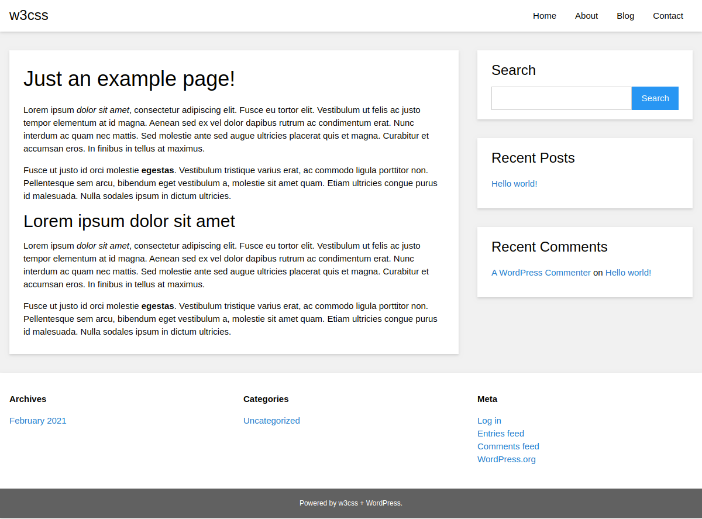

# W3CSS Starter WordPress Theme
WordPress HTML5 boilerplate starter theme created with [W3.CSS](https://github.com/JaniRefsnes/w3css).

## W3.CSS
[W3.CSS](https://github.com/JaniRefsnes/w3css) is a CSS microframework with support for desktop, tablet, and mobile design by default.

## Usage
Use this as a base to build websites for clients or to build completely custom themes from scratch. If you're creating your own theme or client project, open up all files and do a "Find and Replace All in All Files" on the word "w3css" with your own slug and prefix. For support and suggestions, go to: https://github.com/webarthur/w3css-starter/issues. Thank you!

## License

W3CSS Starter is distributed under the terms of the GNU GPL

The W3CSS Starter theme package and all files contained within are distributed under the terms of the GNU GPL v3 or Later (https://www.gnu.org/licenses/gpl.html).

Once you've significantly changed the theme to build your own unique project, either for yourself or for a client under a different theme name (as is encouraged), you're entirely welcome to copyright and license that project as you see fit.
